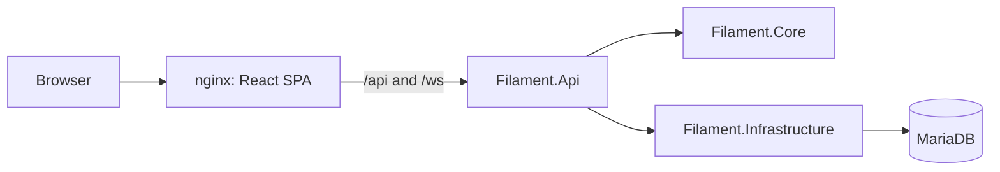
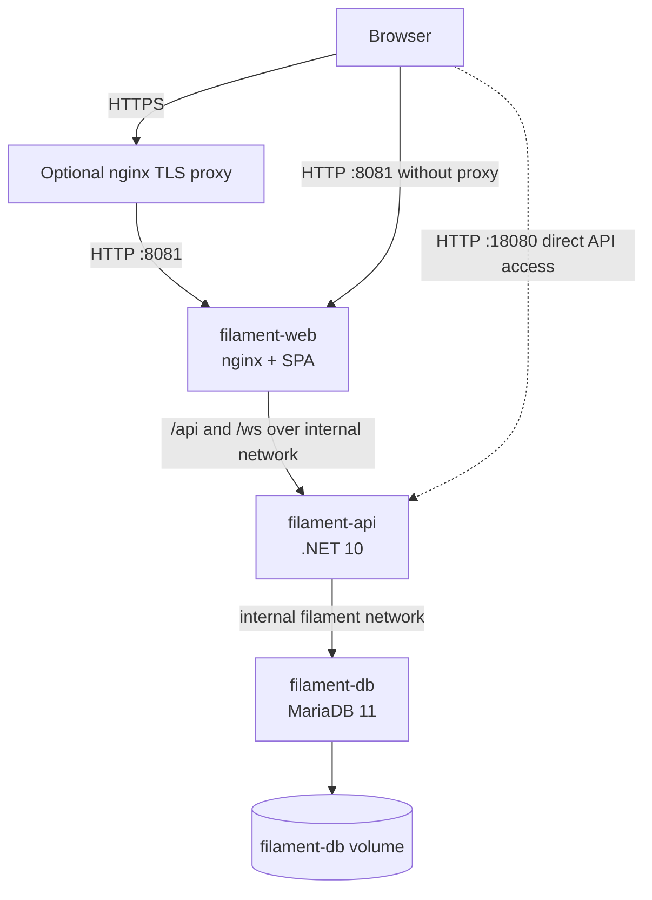

# Architecture

Filament uses a React single-page application, a three-layer .NET backend, and MariaDB. The supported production topology is a rootless Podman Quadlet stack on a modern Linux distro with systemd.

- `Filament.Core` contains domain models, business rules, service abstractions, and identifier generation.
- `Filament.Infrastructure` contains EF Core entities, database access, repositories, and mappings.
- `Filament.Api` hosts HTTP endpoints, DTOs, API-to-domain mappings, PDF generation, and real-time communication.
- `web/` contains the responsive React frontend and nginx runtime configuration.
- `e2e/` contains the Playwright functional test suite (Node + TypeScript) and its own `package.json`; it is independent of the SPA build and runs against the containerized application stack. See [Operations](operations.md) for how to run it.

Business logic should remain independent of EF Core and HTTP where practical so it can be unit-tested. API calls use DTOs and explicit mapping between DTOs, domain models, and persistence entities.

## Data ownership and consistency

MariaDB owns the persistent `filament_types`, `spools`, and `spool_events` tables. The type-to-spool relationship is restrictive, while deleting a spool cascades only to its events. Repository lifecycle writes load one spool and its events, apply one validated plan, recompute derived state, and save the changed event and cache together.

The authoritative material ledger is the enabled event history. `spools.remaining_grams`, status, opened time, finished time, and `lastUsedAt` are denormalized caches for efficient listing and dashboard queries (including the server-side sort of the spool list). The maintenance endpoint recomputes them from history if direct database work caused drift.

At API startup, EF Core migrations run automatically. The API makes ten total attempts (one initial plus nine retries at three-second intervals), then fails so systemd can restart the container rather than serving an unmigrated database.

## Production topology

The normal browser path with the supplied reverse-proxy configuration is `browser -> HTTPS proxy -> filament-web:8081 -> filament-api:8080`. The web Quadlet publishes host port 8081 to its internal nginx port 8080; its nginx proxies `/api/` and `/ws/` to the API service alias on port 8080 across the internal `filament` network. The API Quadlet also publishes host port 18080 (bound to 127.0.0.1), so direct API access remains technically possible from localhost but bypasses the SPA/proxy route and is not the full-browser topology. MariaDB has no published host port and is reached from the host with `podman exec` or from containers on the internal network.

The web and API images are built locally and transferred over SSH with `podman save | podman load`; there is no external application image registry. Quadlet files are synchronized to the deployment user’s `~/.config/containers/systemd/` and managed through that user’s systemd manager.
