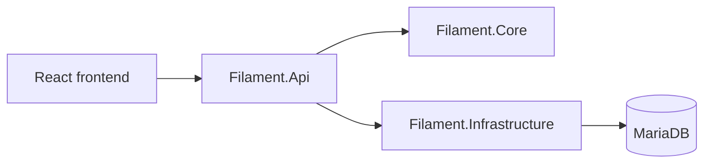

# Architecture

Filament uses a three-layer .NET backend and a React frontend.

- `Filament.Core` contains domain models, business rules, service abstractions, and identifier generation.
- `Filament.Infrastructure` contains EF Core entities, database access, repositories, and mappings.
- `Filament.Api` hosts HTTP endpoints, DTOs, API-to-domain mappings, PDF generation, and real-time communication.
- `web/` contains the responsive React frontend.

Business logic should remain independent of EF Core and HTTP where practical so it can be unit-tested. API calls use DTOs and explicit mapping between DTOs, domain models, and persistence entities.
