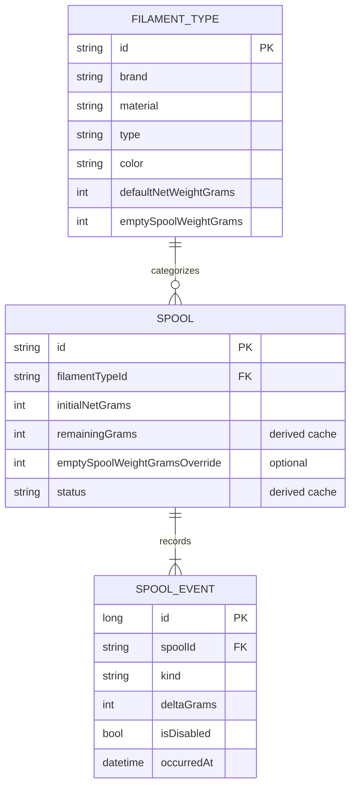
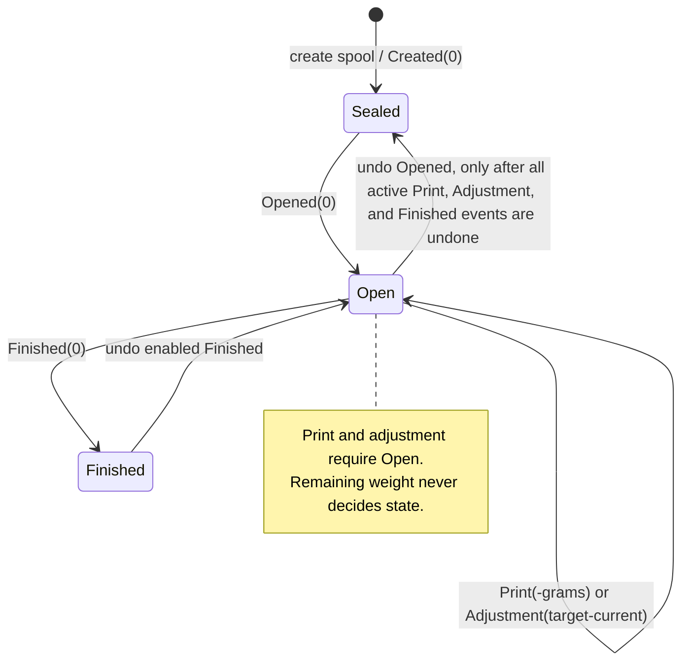

# Domain Model And Rules

## Inventory model

A filament type represents a product/category, not stock. Multiple physical spools can share it. A spool cannot outlive its type in normal application operations: type deletion is rejected while it has any spools. Deleting a spool is allowed and deletes its events through the database foreign-key cascade; this is intended only for an incorrectly created spool.

All weights are integer grams. The database limits type IDs and spool IDs to eight characters although generated IDs have fixed shorter lengths. Notes are limited to 1,024 characters; a print project name is limited to 256 characters and its URL to 1,024 characters.

## Identifiers

Filament assigns random, uppercase identifiers and retries on the extremely unlikely collision before saving.

| Entity | Length | Alphabet | Capacity |
|---|---:|---|---:|
| Filament type | 3 | `0123456789ABCDEFGHJKMNPQRSTVWXYZ` | 32,768 |
| Spool | 4 | `0123456789ABCDEFGHJKMNPQRSTVWXYZ` | 1,048,576 |

The alphabet is Crockford-Base32-like and omits visually confusing letters. For user-entered lookup normalization, whitespace, hyphens, and underscores are ignored; `I` and `L` normalize to `1`, `O` to `0`, and `U` to `V`. Stored/generated values are uppercase. Current HTTP path lookup uses the supplied ID directly, so API clients should send the stored canonical value.

## Weight rules

- A new spool's `initialNetGrams` is its requested initial net weight, or the owning type's default net weight when omitted.
- A spool's effective empty-spool weight is its own override when present; otherwise it is the type's empty-spool weight.
- `totalWeightGrams` exposed by the API is `remainingGrams + effectiveEmptySpoolGrams`.
- The type's default values are copied only as defaults at spool creation. Editing a type later does not change a spool's initial net weight. It does affect a spool's effective empty-spool weight where the spool has no override.
- Remaining grams are initialized from `initialNetGrams` and recalculated as that value plus the deltas of all enabled events. The persisted value is a recoverable read cache, not the source of truth.
- A print must consume a positive whole number of grams and cannot exceed the current remaining balance.
- A weighed adjustment accepts a non-negative target balance and records only the difference between that target and current balance. It may increase or decrease stock.
- Finishing is an explicit zero-gram marker. Reaching zero does not automatically finish a spool.

## Event history and lifecycle

Every spool is created with an enabled `Created` event with zero delta. It cannot be disabled. Events are evaluated chronologically by `occurredAt`; ties are ordered `Created`, `Opened`, `Print`/`Adjustment`, then `Finished`, with the event ID as the final tie-breaker.

For legacy resilience, evaluation treats an enabled print or adjustment encountered while sealed as opening the spool at that event's timestamp. Normal application actions do not rely on this behavior: users must open the spool first.

Undo and redo toggle `isDisabled`; they never erase an event. A disabled event remains visible in history, is displayed as undone, has no running balance, and contributes neither weight nor state. Redoing a print, adjustment, or finish requires at least one enabled `Opened` event. Undoing an opening is rejected until every active print, adjustment, and finish event has been undone. Open and finish reuse the most recent matching undone marker where possible.

The UI gives Finish visual emphasis at or below 5% of the initial net weight, but this is a presentation cue only.

## Lists, stock, and filtering

- Spool lists exclude finished spools by default; `includeFinished=true` includes them.
- The dashboard's active count and total remaining grams exclude finished spools. The finished count includes only finished spools.
- Daily consumption is the sum of enabled, negative-delta events in the requested UTC date range. It includes any negative adjustment as well as print events because both reduce material. The API accepts 1-365 days; the web dashboard requests 30 days.
- Types and spools support the same facets: brand, material, product type, and colour. Values selected within one facet are ORed; selections across facets are ANDed.
- Facet counts ignore their own facet's selection while applying all other selections. All values in the unfiltered universe are shown, including zero-count options, ordered by count descending then lexical value ascending.
- A spool inherits its facet attributes from its filament type. An unresolved type is omitted from a spool-list facet universe.

## Derived-cache repair

`POST /api/spools/reevaluate` evaluates every spool from enabled events and saves only differences in status, remaining grams, opened timestamp, and finished timestamp. It is safe to run and is the supported repair operation after direct database work. It returns each corrected spool's old and new status and balance.
