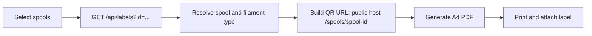

# Interfaces

## Web application

The SPA has these browser routes:

| Route | Purpose |
|---|---|
| `/` | Dashboard counts and the last 30 days of consumption. |
| `/types` | Filament-type list, facets, creation, and deletion. |
| `/spools` | Spool list, facets, finished toggle, creation, label selection, and link to repair. |
| `/spools/:id` | Spool details, current weights/status, lifecycle actions, and event history. |
| `/spools/maintenance` | Re-evaluate all cached spool states. |

The web container serves the SPA and reverse-proxies `/api/` and `/ws/` to the API. Browser history routes resolve to `index.html`. Hashed assets are cached for one year; the HTML shell is deliberately not cached, so a deploy can load a matching client bundle.

## HTTP API

The API uses JSON and serializes enum values as strings. Successful mutations notify connected WebSocket clients. Standard error behavior is `404` for an unknown resource, `400` for invalid lifecycle input, and `409` when a type with spools is deleted. The development environment exposes an OpenAPI document at `/openapi/v1.json`.

| Method and path | Behavior |
|---|---|
| `GET /api/filament-types` | List types and facets. Repeat `brand`, `material`, `type`, and `color` query keys to filter. |
| `GET/PUT/DELETE /api/filament-types/{id}` | Read, replace, or delete a type. Deletion fails if any spool references it. |
| `POST /api/filament-types` | Create a type; the server assigns its ID. |
| `GET /api/spools` | List spools and facets. Supports `filamentTypeId`, `includeFinished`, and the shared facet keys. |
| `GET /api/spools/{id}` | Read a spool, including effective empty-spool and total weights. |
| `POST /api/spools` | Create a sealed spool and its immutable creation event. |
| `DELETE /api/spools/{id}` | Delete a spool and its event history. |
| `GET /api/spools/{id}/events` | List history with running balances; disabled events have `remainingAfterGrams: null`. |
| `POST /api/spools/{id}/open` | Open a sealed spool. |
| `POST /api/spools/{id}/consume` | Record `{ grams, projectName?, projectUrl?, notes? }`. |
| `POST /api/spools/{id}/adjust` | Set `{ newRemainingGrams, notes? }`. |
| `POST /api/spools/{id}/finish` | Add or redo a finish marker. |
| `POST /api/spools/{id}/events/{eventId}/disable` | Undo an event subject to lifecycle guards. |
| `POST /api/spools/{id}/events/{eventId}/enable` | Redo an event subject to lifecycle guards. |
| `POST /api/spools/reevaluate` | Repair cached state for all spools from their histories. |
| `GET /api/dashboard/summary` | Return type, active-spool, finished-spool, and active-remaining totals. |
| `GET /api/dashboard/usage?days=30` | Return daily consumed grams; `days` is clamped to 1-365. |
| `GET /api/labels?id=ABCD&id=EFGH` | Download labels for one or more existing spool IDs. |
| `GET /healthz` | Liveness response: `{"status":"ok"}`. |
| `GET /api/version` | Running backend build version; returns `503` while graceful shutdown is in progress. |

Creation and update payload fields correspond to the domain model. The server currently relies on domain workflow checks rather than a broad request-validation layer; callers should provide valid strings and sensible, non-negative weight values.

## Printable labels

`GET /api/labels` returns `application/pdf` with download name `spool-labels.pdf`. Unknown IDs are skipped; if none resolve, the request returns `404`. At least one `id` query value is required.

Each label is a bordered 70 x 35 mm panel. The generator tiles two labels per row on an A4 page with a 10 mm page margin. A label includes brand, material, type, colour name, a colour swatch only when its supplied hex value is a valid six- or eight-digit hex value, the spool ID, and a 28 mm QR code. The QR payload is an absolute spool page URL assembled from the request scheme and host seen by the API. Generate labels through the web endpoint, not direct API port 8080: the API host does not serve the SPA route embedded in the QR code. The supplied proxy preserves the public host, but the API does not enable forwarded-header processing; its current QR URLs behind TLS termination therefore use `http` and rely on the proxy's HTTP-to-HTTPS redirect. This remains functional with the supplied proxy but is relevant when deploying behind another proxy.

## Real-time and deployment behavior

Clients connect to `GET /ws/changes` as a WebSocket. Any text frame containing `ping` is answered with `{"type":"pong"}`; the SPA sends a ping every 20 seconds and reconnects after failures using exponential backoff from approximately 2 seconds up to 30 seconds.

After an inventory mutation, the server broadcasts `{"type":"change","resource":"spool|filament-type","id":"..."}`. Views reload their relevant data on receipt. During graceful API shutdown, the server sends `{"type":"server-shutdown"}`, closes sockets, and the client polls `/api/version` every five seconds. A changed version triggers a page reload; an unchanged version resumes the UI.

Every HTTP response includes `X-App-Version`. Deploy builds stamp both frontend and backend from the current Git description; dirty builds include a deterministic hash of the uncommitted diff.
